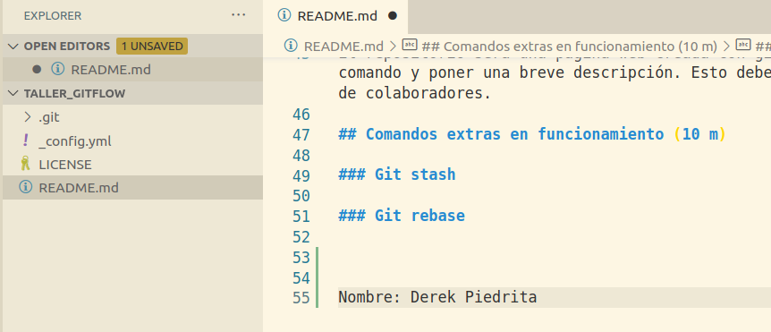

# Git en equipo

## Repaso de cómo funciona git (40 m)

Para poder seguir el tutorial de mejor manera vamos a clonar este repositorio y así tendremos un lugar en dónde ir colocando los comandos que se vayan presentando.

`git clone [https://github.com/renatojobal/taller_gitflow.git](https://github.com/renatojobal/taller_gitflow.git)`

Luego abriremos la carpeta del repositorio con nuestro editor de texto preferido. Podrás seguir leyendo esta guía desde allí abriendo el archivo `README.md`

Cabe recalcar que Gitflow, es una herramienta distinta, sirve para abreviar varios comandos en uno solo. Es importante primero entender cuales son los comandos que suceden por detrás antes de usar Gitflow.

## Git stage (5 m)

El stage en git funciona como un lugar dónde almacenamos los archivos previo a hacer un commit, es decir, una confirmación de los cambios.

Cuando introducimos el comando `git add .` estamos agregando todos los archivos con cambios al stage.

Podemos hacer una prueba de como funciona:

Vamos al archivo [README.md](http://readme.md) y editamos el archivo al final, agregando nuestro nombre.

Ahora en un terminal dentro de nuestra carpeta ejecutamos el comando:

`git status`

Nos dirá lo siguiente:

Quiere decir que git sabe que hemos hecho cambios en ese archivo pero que ese archivo aún no está dentro del "stage" que es necesario para poder hacer un commit

Ejecutamos ahora:

`git add .`

Si ponemos ahora 

`git status`

veremos un resultado como el siguiente:

Nos dice que el archivo ahora está listo para ser parte de un commit.

## Git commits (2 m)

Para recordar, los commits son confirmaciones, sirven para guardar nuestro progreso dentro de los archivos. Git nos ayuda a tener un registro de todos nuestros commits, a los que podemos regresar sin ningún problema. Vamos a hacer un commit en nuestro repositorio de los cambios anteriores con el comando:

`git commit -am "agregar mi nombre"`

En el comando anterior las banderas que usamos -a y -m, son abreviaciones de —all y —message.

## Git merge (2m)

Git merge mezcla dos versiones de nuestros archivos. Por ejemplo ahora vamos a traer los cambios del repositorio en la nube, es decir, de GitHub y mezclarlo con el nuestro.

Primero corremos el comando:

`git fetch`

Salida:

Luego el comando:

`git merge`

Salida:

## Git push (3 m)

Nos sirve para enviar nuestros cambios de la rama actual a un repositorio remoto.

## Git tag (10 m)

Nos sirve para etiquetar nuestros commits, es muy útil para organizarnos entre versiones. Existen dos tipos de etiquetas en git: **lightweight** y **annotated**.

Una etiqueta **lightweight** es muy parecida a una rama que no cambia, es solo un puntero a una confirmación específica.

Sin embargo, las etiquetas **annotated** se almacenan como objetos completos en la base de datos de Git. Están sumados a la suma de verificación; contener el nombre del etiquetador, el correo electrónico y la fecha; tener un mensaje de etiquetado; y se puede firmar y verificar con GNU Privacy Guard (GPG). En general, se recomienda que cree etiquetas con anotaciones para poder tener toda esta información.

Para crear etiquetas annotated podemos usar:

`git tag -a v1.4 -m "my version 1.4"`

Y para crear etiquetas lightweight:

`git tag v1.4-lw`

- Más información en: [https://git-scm.com/book/en/v2/Git-Basics-Tagging](https://git-scm.com/book/en/v2/Git-Basics-Tagging)

## Git branchs (20 m)

Crear ramas:

`git branch experiment`

Listar todas las ramas:

`git branch -al`

Eliminar ramas:

Nos cambiamos a la rama `main`

`git checkout main`

Eliminamos la rama creada previamente:

`git branch -D experiment`

Traer ramas en remoto:

`git pull origin main`

## Git flow (120 m)

Explicar como funcionan las ramas dentro de Gitflow:

- master
- development
- release
- hotfix

Práctica (90 m)

Instalar Gitflow

Usando comandos con Gitflow

Trabajar en un repositorio compartido

Enlace: []

El repositorio será una página web creada con github pages que hable sobre los comandos en git. Cada estudiante deberá escoger un comando y poner una breve descripción. Esto deberá hacerse siguiendo el flujo de Gitflow. , además colocar su nombre en la sección de colaboradores.

## Comandos extras en funcionamiento (10 m)

### Git stash

### Git rebase